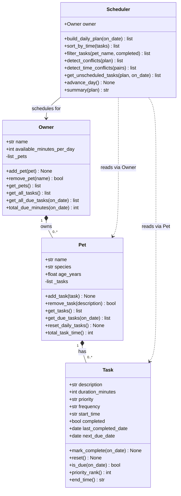

# PawPal+ — Mermaid.js Class Diagram



## Relationship key

| Symbol | Meaning |
|--------|---------|
| `*--`  | Composition — child cannot exist without the parent |
| `-->`  | Association — Scheduler holds a direct reference to Owner |
| `..>`  | Dependency — Scheduler reads Pet/Task but does not own them |

## Data flow (how Scheduler reaches tasks)

```
Scheduler.build_daily_plan()
    └── owner.get_all_due_tasks()
            └── pet.get_due_tasks()
                    └── task.is_due()

Scheduler.sort_by_time(tasks)
    └── sorted(..., key=lambda t: t.start_time or "99:99")

Scheduler.detect_time_conflicts()
    └── owner.get_all_tasks()
            └── compare HH:MM windows pairwise
```
